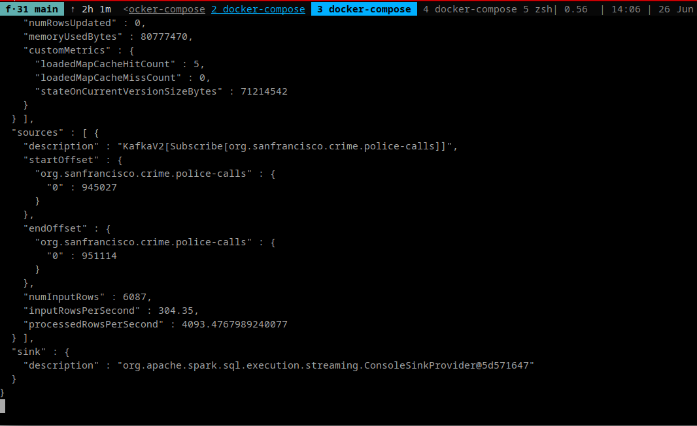

#  Structured Streaming Pipeline with Apache Spark and Apache Kafka

Here we use Apache Spark with Apache Kafka to create a structured streaming pipeline for processing data from kafka events. 

### Process
1. Kafka Producer: Extracts the data from a raw JSON file and pushes the data to a Kafka server.
2. Spark Task: 
    * Pulls the data from the Kafka stream
    * Loads and transforms the data
    * runs some computations on the dataset
    * join data with another static dataset read from another JSON file 
    * outputs the statistics and results

## Screenshots
Spark UI|
-|
|

KafkaProducer Log|
-|
|

## Requirements
* Docker

## Installation/Running locally
1. Run `docker-compose up` to bring up the containers. 
1. Enter `notebook` container which has spark installed: `docker-compose exec notebook bash`
1. Change working directory: `cd work`
1. Install dependancies and unpack data: `./start.sh install`
1. Run kafka data source to simulate events: `./start.sh producer`
1. (optional) Run kafka data sink to consume events (for testing): `./start.sh producer`
1. Run spark task: `./start.sh spark`

## Performance Optimisation

There are a number of configuration values that can be tuned to achieve optimal and efficient spark stream processing.

Using a **trigger** with a `processingTime` that is too low can reduce throughput and increase latency. A trigger causes expensive (IO Read/Write) shuffle operations across the cluster.
This can be seen by testing out different values for `processingTime`. For example, `processingTime='1 second'` causes too much reshuffling and reduces **processedRowsPerSecond**. Changing from `1` to `2` seconds increased **processedRowsPerSecond** (from ~600 to ~1000)

Tracking **inputRowsPerSecond** vs **processedRowsPerSecond** helps in identifying which SparkSession configuration pairs were most efficient.   

A higher **processedRowsPerSecond** indicates a higher throughput and lower latency. Higher **inputRowsPerSecond** suggests a lower latency.

Streaming Progress Report|
-|
|

We tried adjusting SparkSession property parameters to see which values we can tune to optimize the latency and throughput of spark tasks. 

The SparkSession property key/value pairs that had most effect on increasing throughput while minimizing latency where:
* trigger `processingTime` - Setting a higher value achieved higher throughput in our example. Don't set too low.
* `spark.default.parallelism=2` - Number of tasks that can run in parallel per core 
* `spark.sql.shuffle.partitions=4` - Number of partitions to use on aggregates and join RDDs

